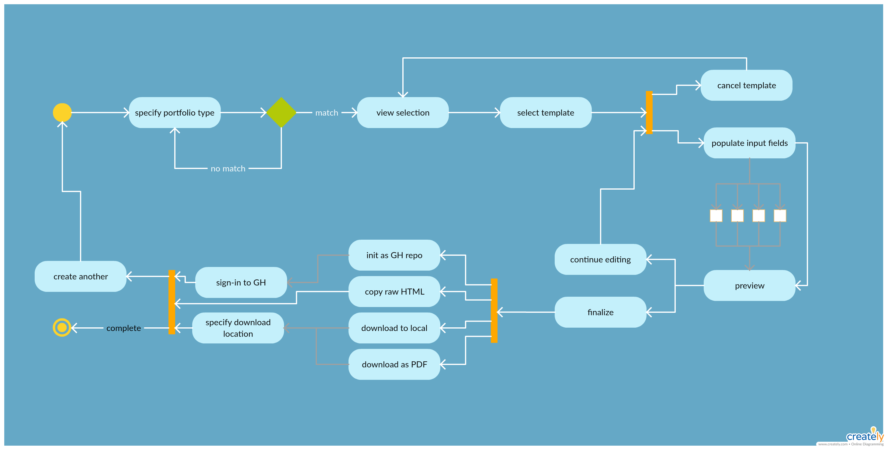

# 
### Developer Portfolio Builder
“You're not a designer”

|      | Table of Contents |
| ---- | ----------------- |
| I.   | [Proposal](#proposal) |
| II.  | [App](#app) |
| III. | [Team Members](#team) |
| IV.  | [Tools](#tools) |
| V.   | [File Tree](#filetree) |
| VI.  | [Contributions](#contributionpolicy) |

 

## Proposal 

### Issue
As budding web developers applying for jobs in the field, sometimes creating an initial portfolio site can be daunting, if not at the bottom of our list of things to do.

### Fix
Project3 lets you build static portfolio sites quickly and with your information and data.

 

## App 

### Wireframe
[Live Wireframe](https://xd.adobe.com/view/5a9d41a9-6662-404d-8489-166a20209558/?hints=off)

<kbd><kbd>

| Site Flow | Resume Flow |
| :-------: | :---------: |
|  |  |
|  |  |
|  |  |
|  |  |

### User Flow

### Data Flow

 

## Team 

### Jason Summers
- DevOps
### Alex Pugh
- Front-end Development
### Kui Eugenio
- Back-end Development
### Cody Crozier
- Back-end Development

 

## Tools 

-  React - app build
-  Node.js
  -  Body-Parser - translate various formats
  -  Express.js
  -  Handlebars - templating engine for user generated templates
  -  Mongoose -  manipulating MongoDB
-  Heroku - app deployment
-  MongoDB - to capture users, resources, interaction
-  Bootstrap 4 - HTML/CSS frameworks for app
-  Bootstrap 3.0.2 - Template formatting use
-  OAuth (GitHub) - login and administering of privileges
-  Electron - multi-platform usability (desktop or in-browser)
-  GitHub - repository for versioning and project cards
-  Google Drive - doc coordination and hosting
-  Slack Channel (private) - team communication
-  Draw io - mockups and wireframes for site, user flow, and database organization

 

## File Tree 

{{ tree }}

 

## Contribution Policy 

### Branch Assignments
#### master - Protected
#### app - Work within porthub/
#### dev - Work on infrastructure items (README.md, templates/, concepts/, assets/)
#### devops - Work on devops/

### GitHub Flow
GitHub Flow is a simple and effective branching strategy which the folks at GitHub use. Most teams actually do not need everything GitFlow gives them and are much better off with a simpler workflow.

GitHub Flow is in a nutshell:

1. Update master to latest [upstream](../reference/git-setup.md#upstream) code
1. Create a feature branch `git checkout -b myFeatureBranch`
1. Do the feature/work
1. Push feature branch to [origin](../reference/git-setup.md#origin)
1. Create pull request from origin/<featureBranch> -> upstream/master
1. Review, fix raised comments, merge your PR or even better, get someone else to.

The main rule of GitHub Flow is that master should *always* be deployable. GitHub Flow allows and encourages [continuous delivery](../reference/continuous-delivery.md).

#### Resources
 - [GitHubFlow guide by GitHub](https://guides.github.com/introduction/flow/index.html)
 - [GitHub Flow original blog post](http://scottchacon.com/2011/08/31/github-flow.html)
 - [Phil Haack's (haacked) GitHubFlow aliases](http://haacked.com/archive/2014/07/28/github-flow-aliases/)
 - [GitHubFlow vs GitFlow](http://lucamezzalira.com/2014/03/10/git-flow-vs-github-flow/)
